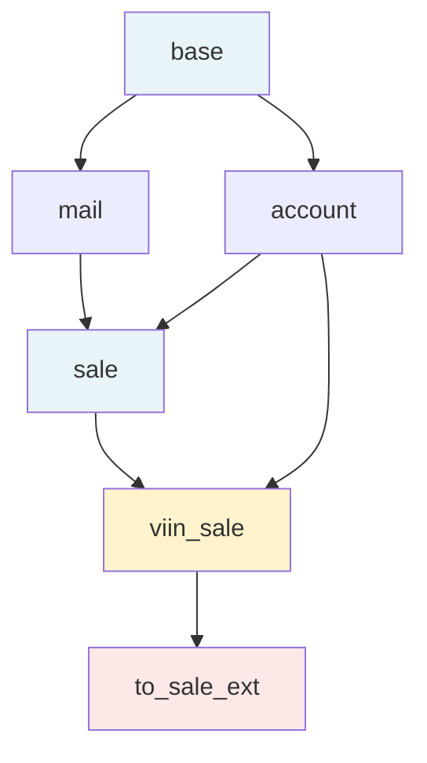
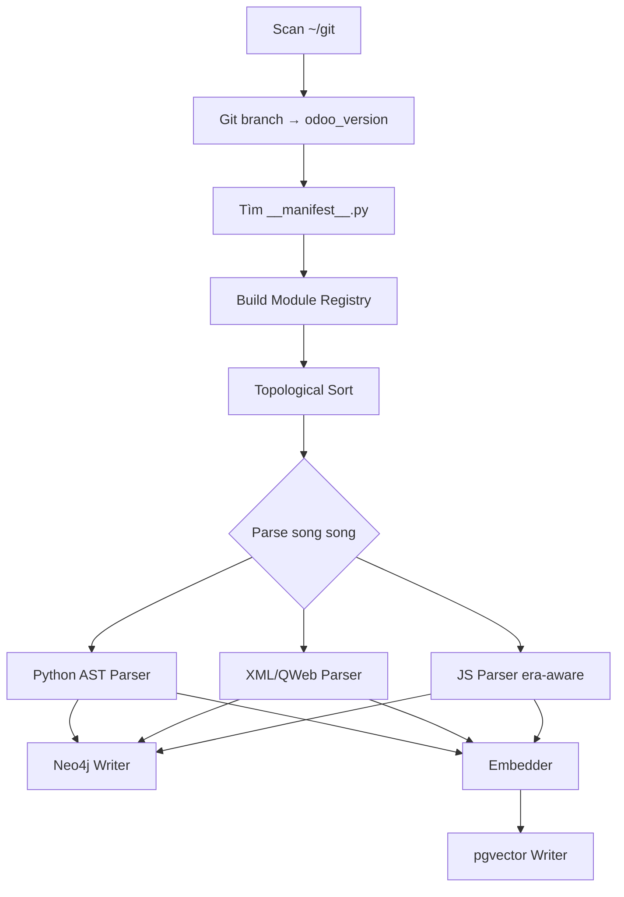

# Thiết Kế Kiến Trúc — Odoo Semantic MCP

> **Phiên bản:** 1.0  
> **Ngày:** 2026-05-05  
> **Trạng thái:** Đã duyệt, chờ triển khai

---

## Nguyên Tắc Phát Triển

### Boil the Lake

> "Làm đúng từ đầu rẻ hơn làm lại."

Trong dự án này, "boil the lake" có nghĩa là:

- **Không làm MVP nửa vời.** Một công cụ chỉ hiểu được 1 repo hay 1 version không tạo ra giá trị thật.
- **Thiết kế schema version-aware và cross-repo ngay từ đầu.** Migration schema sau khi đã có dữ liệu tốn gấp 10 lần so với làm đúng lúc đầu.
- **Index toàn bộ stack** (Python model, XML view, JS patch) thay vì chỉ index một phần. Giá trị thật sự đến từ việc trace được toàn bộ chuỗi từ model → view → JS component.

Khi AI agent viết code cho dự án này: **đừng bỏ qua edge case, đừng hardcode version, đừng giả định single-repo.**

### Ship Wow Product

> "Người dùng phải có cảm xúc 'Wow' khi lần đầu dùng sản phẩm."

Cảm xúc "Wow" đến khi:

1. Developer hỏi *"Explain `account.move` inheritance chain in 17.0"* → AI trả lời đúng cross-repo, không hallucinate tên field hay method.
2. Engineering lead chạy `impact_analysis("field", "sale.order.amount_total")` → nhận được danh sách chính xác 47 views và 12 modules bị ảnh hưởng.
3. Developer mới onboard thêm **1 dòng URL** vào config Claude Code → lập tức dùng được, không cài thêm gì.

Khi AI agent thiết kế response format hay UX: **ưu tiên output dễ đọc, có cấu trúc, không thừa thãi.**

---

## Intent & Outcome Tổng Thể

**Intent:** Xây dựng một knowledge engine hiểu sâu codebase Odoo — inheritance chain, view structure, JS patch — và expose qua MCP protocol để mọi AI coding tool đều dùng được.

**Outcome:**
- AI coding tool giảm hallucination về Odoo API xuống dưới 5%
- Developer tiết kiệm 30–50% thời gian tìm hiểu codebase khi onboard hoặc debug
- Impact analysis chính xác trước khi thay đổi bất kỳ field/method nào
- Server admin deploy được trong dưới 10 phút; end user không cần cài gì — chỉ cần URL + API key

---

## Mô Hình Triển Khai

Hệ thống chia 3 tier độc lập — mỗi tier có thể chạy trên server riêng hoặc gộp lại tùy nhu cầu. App tier kết nối DB tier hoàn toàn qua env vars (`NEO4J_URI`, `PG_DSN`).

```
┌────────────────────────────────────────────────────────────────────┐
│  CLIENT TIER  (máy tính người dùng)                                 │
│   Claude Code / Codex / Gemini / VS Code                           │
│   Config: NEO4J_URI = "https://semantic.viindoo.com/mcp"           │
│           X-API-Key: <key do admin cấp>                            │
└───────────────────────────┬────────────────────────────────────────┘
                            │  HTTPS / MCP protocol
                            ▼
┌────────────────────────────────────────────────────────────────────┐
│  APP TIER  (app server)                                             │
│                                                                     │
│  ┌──────────────────────────────────────────────────────────────┐  │
│  │  Odoo Repositories (cloned)                                   │  │
│  │  ~/git/*_{version}/   (419+ thư mục, 12 versions)            │  │
│  └──────────────────────────────┬────────────────────────────────┘  │
│                                 │  đọc trực tiếp từ host filesystem │
│                                 ▼                                   │
│  ┌──────────────────────────────────────────────────────────────┐  │
│  │  PYTHON RUNTIME  (Python 3.12+, venv tại ~/.venv/odoo-semantic-mcp)  │  │
│  │                                                               │  │
│  │  [CLI — one-shot]          [Server — long-running]            │  │
│  │  python -m src.cli         python -m src.mcp.server           │  │
│  │  └─ INDEXER PIPELINE       └─ FastMCP HTTP :8002              │  │
│  │     1. Scanner                 systemd giữ process alive      │  │
│  │     2. Registry Builder                                       │  │
│  │     3. Dep Resolver                                           │  │
│  │     4. Parsers (AST/lxml/tree-sitter)                         │  │
│  │     5. Embedder                                               │  │
│  └──────────────────────────────────────────────────────────────┘  │
│                                                                     │
│  Kết nối DB qua env vars — trỏ localhost hoặc remote server:       │
│    NEO4J_URI=bolt://[db-server]:7687                                │
│    PG_DSN=postgresql://user:pass@[db-server]:5432/odoo_semantic     │
│                                                                     │
│  ┌──────────────────────────────────────────────────────────────┐  │
│  │  Nginx                                                        │  │
│  │  /mcp  → MCP Server  :8002  (FastMCP, 6 tools)               │  │
│  │  /ui   → Web UI      :8003  (dashboard + API key mgmt)       │  │
│  └──────────────────────────────────────────────────────────────┘  │
└─────────────────────────────┬──────────────────────────────────────┘
                              │  bolt://:7687   postgresql://:5432
                              │  (private network / firewall)
                              ▼
┌────────────────────────────────────────────────────────────────────┐
│  DB TIER  (db server — có thể tách riêng hoặc gộp với app server)   │
│                                                                     │
│  ┌──────────────────────────┐  ┌─────────────────────────────────┐  │
│  │  Neo4j 5.26.25           │  │  PostgreSQL 16 + pgvector 0.8.2 │  │
│  │  bolt:// :7687           │  │  :5432                          │  │
│  │  (browser: 127.0.0.1     │  │                                 │  │
│  │   :7474 — local only)    │  │  embeddings, api_keys,          │  │
│  │                          │  │  usage_log                      │  │
│  │  modules, models,        │  └─────────────────────────────────┘  │
│  │  fields, methods,        │                                       │
│  │  views, js_patches       │  docker-compose.yml chạy ở đây       │
│  └──────────────────────────┘                                       │
└────────────────────────────────────────────────────────────────────┘
```

**Deployment options:**

| Cấu hình | Mô tả | Khi nào dùng |
|----------|-------|-------------|
| All-in-one | App + DB trên cùng 1 server | Dev, staging, small team |
| App / DB tách | App server riêng, DB server riêng | Production, muốn scale app độc lập |
| App / Neo4j / PG tách | Mỗi thứ 1 server | Scale lớn, HA requirements |

Thay đổi tier chỉ cần đổi env vars — không cần sửa code.


**Luồng onboard end user — zero install:**

```
1. Admin tạo API key trên Web UI  →  gửi key cho user
2. User thêm vào config:
   Claude Code:  ~/.claude/settings.json
   VS Code:      settings.json (MCP extension)
   Codex/Gemini: config tương ứng
3. Xong. Dùng được ngay.
```

---

## Kiến Trúc Tổng Thể (Chi Tiết)

**Ba nguyên tắc lưu trữ:**

| Layer | Công nghệ | Vai trò |
|-------|-----------|---------|
| Graph | Neo4j | Đảm bảo **độ chính xác** — inheritance chain, override chain |
| Vector | pgvector | Đảm bảo **tốc độ tìm kiếm** — semantic search theo ngữ nghĩa |
| Cache | PostgreSQL | Đảm bảo **tiết kiệm chi phí** — hot queries không cần recompute |

---

## Thiết Kế Chi Tiết

### 1. Version Awareness

Mỗi node trong Neo4j đều có property `odoo_version` (ví dụ: `"17.0"`).

**Quy tắc xác định version từ module:**

```
Ưu tiên 1: manifest `version` dạng long → "17.0.1.0.0" → lấy 2 phần đầu → "17.0"
Ưu tiên 2: git branch của repo chứa module → git branch --show-current → "17.0"
Fallback:   "unknown" → log warning, bỏ qua khi index
```

Lý do dùng git branch thay vì tên thư mục: branch là nguồn thật sự do Viindoo/OCA quản lý, tên thư mục chỉ là quy ước của `viindoo-clone.sh` và không đáng tin.

---

### 2. Module Registry

Trước khi parse bất kỳ thứ gì, indexer phải biết module nào nằm ở repo nào.

```
Scan ~/git/*/ (hoặc thư mục user cấu hình)
        │
        ├─ git -C <dir> symbolic-ref --short HEAD → odoo_version
        └─ find <dir> -name "__manifest__.py"
                │
                ├─ đọc name, depends, version
                └─ ghi vào registry:

registry["17.0"]["sale"] = {
    repo: "odoo_17.0",
    path: "/home/.../git/odoo_17.0/addons/sale",
    depends: ["base", "account", "product"]
}
```

**Xử lý xung đột:** nếu cùng tên module xuất hiện 2 lần trong cùng version, ưu tiên module có `version` dạng long (chứa Odoo version prefix) làm tiebreaker, log warning còn lại.

---

### 3. Dependency Resolution



Topological sort (Kahn's algorithm) đảm bảo base modules được index trước, INHERITS edges trong Neo4j luôn có target node tồn tại sẵn.

**Edge case:**
- **Circular dependency:** log error, cắt cạnh yếu nhất (alphabetical fallback), tiếp tục
- **Missing dependency:** log warning; tạo placeholder `Model {module: '__unresolved__'}`
  + edge với property `unresolved: true`. Re-index sau sẽ MERGE vào node thật.
  Query layer filter `WHERE NOT coalesce(r.unresolved, false)`.

---

### 4. Neo4j Graph Schema

#### Nodes

```
(:Module   { name, odoo_version, repo, path, version_raw })
(:Model    { name, module, odoo_version, is_abstract, is_transient })
           // KEY = (name, module, odoo_version) — N nodes cho cùng model name
           // mỗi module define/extend model đó có 1 node riêng
(:Field    { name, model, module, odoo_version, ttype, related, compute, stored, required })
           // KEY = (name, model, module, odoo_version)
(:Method   { name, model, module, odoo_version, has_super_call, decorators })
           // KEY = (name, model, module, odoo_version)
(:View     { xmlid, odoo_version, type, mode })     // mode: primary | extension
(:QWebTmpl { xmlid, odoo_version, module })
(:JSPatch  { target, patch_name, odoo_version, module, era })
                                                    // era: extend | include | patch
(:OWLComp  { name, odoo_version, module, template })
```

#### Relationships

```
// Lớp Module
(m1:Module)-[:DEPENDS_ON]->(m2:Module)

// Lớp Model
(:Model)-[:DEFINED_IN]->(:Module)
(:Model)-[:INHERITS]->(:Model)                       // _inherit  (priority: planned, chưa set ở M1)
(:Model)-[:DELEGATES_TO { via_field }]->(:Model)     // _inherits

// Lớp Field / Method
(:Field )-[:BELONGS_TO]->(:Model)
(:Field )-[:EXTENDS   ]->(:Field)                    // field override chain  (planned, chưa có ở M1)
(:Method)-[:BELONGS_TO]->(:Model)
(:Method)-[:OVERRIDES  { has_super: bool }]->(:Method)  // (planned, chưa có ở M1)

// Lớp View / QWeb
(:View    )-[:DEFINED_IN   ]->(:Module)
(:View    )-[:INHERITS_VIEW]->(:View)
(:View    )-[:TARGETS_MODEL]->(:Model)
(:QWebTmpl)-[:DEFINED_IN   ]->(:Module)
(:QWebTmpl)-[:EXTENDS_TMPL ]->(:QWebTmpl)

// Lớp JS
(:JSPatch )-[:DEFINED_IN]->(:Module)
(:JSPatch )-[:PATCHES   ]->(:OWLComp)
(:JSPatch )-[:PATCHES   ]->(:JSPatch)               // legacy patch chain
(:OWLComp )-[:EXTENDS   ]->(:OWLComp)
(:OWLComp )-[:BOUND_TO  ]->(:Model)
```

#### Ví dụ query Cypher

Resolve tất cả module-scoped nodes của `sale.order` trong 17.0 (C1 schema):

```cypher
// Lấy tất cả nodes theo thứ tự base→extension (ít inbound INHERITS nhất = base)
MATCH (m:Model {name: 'sale.order', odoo_version: '17.0'})-[:DEFINED_IN]->(mod:Module)
RETURN m.module AS module_name, mod.repo AS repo,
       COUNT { ()-[:INHERITS]->(m) } AS depth
ORDER BY depth ASC
```

Lấy toàn bộ INHERITS chain (bao gồm cross-name mixins):

```cypher
MATCH path = (:Model {name: 'sale.order', odoo_version: '17.0'})
             -[:INHERITS*]->(:Model {odoo_version: '17.0'})
RETURN path
```

Impact analysis khi đổi field `amount_total` (M1 scope, full version Milestone 4):

```cypher
MATCH (f:Field {name: 'amount_total', model: 'sale.order', odoo_version: '17.0'})
      <-[:BELONGS_TO]-(m:Model)
      <-[:TARGETS_MODEL]-(v:View)
RETURN f, m, v
```

---

### 5. Indexer Pipeline



**JS Parser — phân biệt theo era:**

| Era | Odoo version | Pattern nhận diện | Cơ chế override |
|-----|-------------|-------------------|-----------------|
| 1 | 8.0–11.0 | `Widget.extend(` | `.extend()` / namespace |
| 2 | 12.0–15.0 | `odoo.define(` | `.include()` / AMD require |
| 3 | 16.0+ | `/** @odoo-module */` | `patch()` / ES6 import |

**Incremental re-index:** mỗi module lưu git commit hash tại thời điểm index. Lần sau chỉ re-parse module có hash thay đổi.

---

### 6. MCP Tools Interface

Tất cả tools đều nhận `odoo_version` (mặc định: version cao nhất đã index).

#### `resolve_model(model_name, odoo_version?)`

```
Input:  "sale.order", "17.0"
Output:
  sale.order (Odoo 17.0)
  ├─ Định nghĩa tại:   [odoo] addons/sale/models/sale_order.py
  ├─ Kế thừa từ:       account.move.mixin, mail.thread, mail.activity.mixin
  ├─ Mở rộng bởi:
  │   ├─ [tvtmaaddons]          viin_sale        → thêm: x_approval_state
  │   └─ [erponline-enterprise] to_sale_ext      → override: action_confirm()
  ├─ Tổng số field:    47 (12 từ extension)
  └─ Tổng số method:   23 (8 bị override)
```

#### `resolve_field(model_name, field_name, odoo_version?)`

Trả về: field gốc, extension chain, computed/related metadata.

#### `resolve_method(model_name, method_name, odoo_version?)`

Trả về: override chain theo thứ tự base→top, có/không gọi `super()`.

#### `resolve_view(xmlid, odoo_version?)`

Trả về: inheritance chain, xpath modifications, XML skeleton sau khi merge.

#### `find_examples(query, odoo_version?, limit?)`

Hybrid retrieval:
1. pgvector ANN search → top-20 candidates
2. Neo4j rerank → ưu tiên candidates trong dependency chain của context
3. Trả về top-N với snippet + file_path + score

#### `impact_analysis(entity_type, entity_name, odoo_version?)`

Trả về: affected models, views, JS components, dependent modules, risk level (low/medium/high).

---

### 7. API Key & Web UI

```
Web UI (cổng 8003)
├── /           Dashboard: trạng thái index, version coverage
├── /keys       Quản lý API key: tạo / thu hồi / xem quota
├── /usage      Log sử dụng: request theo key, tool, latency
└── /index      Quản lý indexing: trigger re-index, xem tiến độ
```

Schema PostgreSQL:

```sql
api_keys  (id, key_hash, name, owner, quota_daily, created_at, revoked_at)
usage_log (id, key_id, tool, odoo_version, latency_ms, ts)
```

---

### 8. Đóng Gói & Backup/Restore

**Cấu trúc thư mục:**

```
odoo-semantic-mcp/
├── docker-compose.yml      -- Neo4j + PostgreSQL + MCP server + Web UI
├── .env.example            -- NEO4J_IMAGE, NEO4J_PASSWORD, PG_DSN, API_MASTER_KEY
├── install.sh              -- cài đặt không dùng Docker
└── cli/
    ├── index.py            -- odoo-semantic index --base-dir ~/git --version 17.0
    ├── backup.py           -- odoo-semantic backup --out backup-YYYYMMDD.tar.gz
    └── restore.py          -- odoo-semantic restore --from backup-YYYYMMDD.tar.gz
```

**Quy trình chuyển server:**

```
Server A  →  odoo-semantic backup  →  backup.tar.gz
                                            │
                                     scp sang Server B
                                            │
Server B  →  docker compose up -d  →  odoo-semantic restore
             (không cần re-index lại từ đầu)
```

---

## Lộ Trình Triển Khai

### Milestone 1 — "First Wow" (Ngày 1–2)

**Intent:** Chứng minh giá trị cốt lõi: AI hiểu được inheritance chain của Odoo cross-repo.

**Outcome:** Gõ `resolve_model("account.move", "17.0")` trong VS Code → Claude trả lời đúng toàn bộ chain từ `odoo` → `tvtmaaddons` → `erponline-enterprise`, không hallucinate.

```
[Ngày 1]
  - Infrastructure: docker-compose (Neo4j + PostgreSQL)
  - scanner.py: git branch detection + manifest discovery
  - registry.py: module registry per version
  - resolver.py: topological sort + xử lý circular dep

[Ngày 2]
  - parser_python.py: _name/_inherit/_inherits/fields/methods
  - writer_neo4j.py: nodes + edges
  - mcp_server.py: resolve_model + resolve_field + resolve_method
  - E2E test: VS Code + Claude Code
```

---

### Milestone 2 — "View Wow" (Ngày 3)

**Intent:** Mở rộng semantic awareness sang UI layer.

**Outcome:** `resolve_view("sale.order.form", "17.0")` trả về đúng tất cả XPath override từ mọi module, kèm XML skeleton sau merge.

```
[Ngày 3]
  - parser_xml.py: views, inherit_id, xpath targets
  - parser_qweb.py: template inheritance
  - mcp_server.py: resolve_view + merged_structure
```

---

### Milestone 3 — "Semantic Wow" (Ngày 4)

**Intent:** Thêm khả năng tìm kiếm theo ngữ nghĩa.

**Outcome:** `find_examples("compute tax based on partner country")` trả về code thật từ codebase Viindoo, có liên quan, có thể dùng ngay.

```
[Ngày 4 sáng]
  - embedder.py: nomic-embed-text via Ollama (offline-first)
  - writer_pgvector.py: chunk + store embeddings

[Ngày 4 chiều]
  - mcp_server.py: find_examples (hybrid retrieval)
```

---

### Milestone 4 — "Impact Wow" (Ngày 4–5)

**Intent:** Full-stack impact analysis từ Python model đến JS component.

**Outcome:** `impact_analysis("field", "sale.order.amount_total", "17.0")` liệt kê chính xác mọi view, method, và JS patch bị ảnh hưởng kèm risk level.

```
[Ngày 4 tối]
  - parser_js.py: era-aware (extend / include / patch)
  - writer_neo4j.py: JSPatch + OWLComponent nodes

[Ngày 5 sáng]
  - mcp_server.py: impact_analysis + risk_level scoring
```

---

### Milestone 5 — "Product Wow" (Ngày 5–6)

**Intent:** Đóng gói thành sản phẩm server admin deploy được trong dưới 10 phút; end user không cài gì.

**Outcome (server admin):** `docker compose up -d && odoo-semantic index --version 17.0` → sẵn sàng phục vụ users.

**Outcome (end user):** Nhận URL + API key từ admin → thêm 3 dòng config → dùng được ngay, không cài thêm gì.

```
[Ngày 5 chiều]
  - auth.py: API key middleware + usage log
  - web_ui/: dashboard + key management + index status

[Ngày 6]
  - cli.py: index / backup / restore
  - docker-compose.yml: hoàn thiện + .env.example
  - install.sh: non-Docker path
  - README.md:
      + Hướng dẫn server admin: deploy, index, quản lý key
      + Hướng dẫn end user: thêm config vào Claude Code / VS Code / Codex / Gemini
```

---

### Milestone 6 — "Scale Wow" (Ongoing)

**Intent:** Hỗ trợ toàn bộ ecosystem Viindoo, multi-version, incremental.

**Outcome:** Index đồng thời 16.0 + 17.0 + 18.0. Re-index chỉ mất vài giây thay vì vài giờ.

```
  - incremental.py: git commit hash tracking
  - Multi-version: index song song nhiều versions
  - version_presets.py: preset "viindoo-17.0"
  - OpenUpgrade support: migration path awareness
```

---

## Cấu Trúc Thư Mục Dự Án

```
odoo-semantic-mcp/
├── docker-compose.yml
├── .env.example
├── install.sh
├── README.md
├── TASKS.md                        -- bảng theo dõi tiến độ
├── docs/
│   └── thiet-ke-kien-truc.md       -- tài liệu này
├── src/
│   ├── indexer/
│   │   ├── scanner.py              -- quét repo, phát hiện version
│   │   ├── registry.py             -- module registry per version
│   │   ├── resolver.py             -- topological sort dependencies
│   │   ├── parser_python.py        -- Python AST parser
│   │   ├── parser_xml.py           -- XML view parser
│   │   ├── parser_qweb.py          -- QWeb template parser
│   │   ├── parser_js.py            -- JS parser (era-aware)
│   │   ├── embedder.py             -- tạo embeddings
│   │   ├── writer_neo4j.py         -- ghi graph vào Neo4j
│   │   ├── writer_pgvector.py      -- ghi vectors vào pgvector
│   │   └── incremental.py          -- git hash tracking
│   ├── mcp/
│   │   └── server.py               -- MCP server + 6 tools
│   ├── web_ui/
│   │   ├── app.py                  -- FastAPI app
│   │   └── templates/              -- Jinja2 templates
│   ├── auth.py                     -- API key middleware
│   └── cli.py                      -- index / backup / restore
└── tests/
```

---

## Tóm Tắt Timeline

```
Ngày 1–2  │ M1: First Wow    → resolve_model cross-repo hoạt động
Ngày 3    │ M2: View Wow     → resolve_view + merged XML
Ngày 4    │ M3+M4: Semantic + Impact Wow
Ngày 5–6  │ M5: Product Wow  → Docker deploy + Web UI + CLI
Ngày 7+   │ M6: Scale Wow    → multi-version, incremental
```

---

## Điều Hướng Tài Liệu

| | File | Nội dung |
|---|------|----------|
| ← | [`/README.md`](../README.md) | Điểm bắt đầu: tổng quan, onboard, hướng dẫn deploy |
| ↓ | [`/docs/huong-dan-stack.md`](huong-dan-stack.md) | Hướng dẫn stack: tại sao mỗi công nghệ, cách dùng đúng, bẫy cần tránh |
| ↓ | [`/TASKS.md`](../TASKS.md) | Tiến độ hiện tại — task nào đang làm, task nào tiếp theo |
| ↓ | [`plans/2026-05-05-milestone-1-first-wow.md`](superpowers/plans/2026-05-05-milestone-1-first-wow.md) | Implementation plan chi tiết Milestone 1 (TDD, từng bước) |
